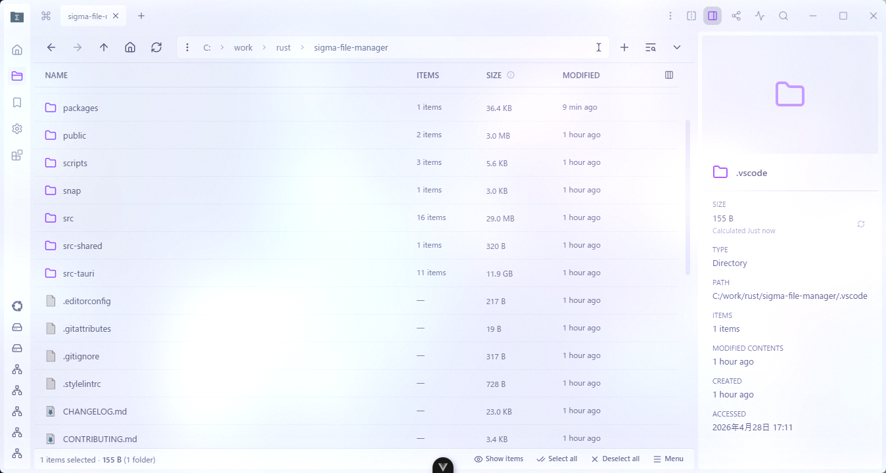
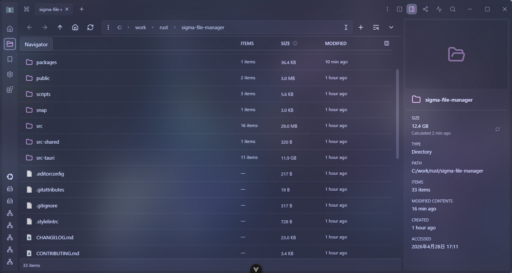
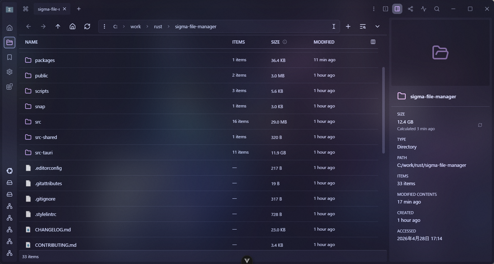

# Catppuccin Themes extension

Local Sigma File Manager extension that adds the four official Catppuccin flavors:

- Catppuccin Latte
- Catppuccin Frappe
- Catppuccin Macchiato
- Catppuccin Mocha

## Screenshots

| Latte | Frappe |
| --- | --- |
|  |  |

| Macchiato | Mocha |
| --- | --- |
|  |  |

## Install locally

1. Open **Extensions** in Sigma File Manager.
2. Choose **Install local extension**.
3. Select this folder:

   `packages\extensions\catppuccin-themes`

After installation, the four flavors appear in **Settings > Theme**.
