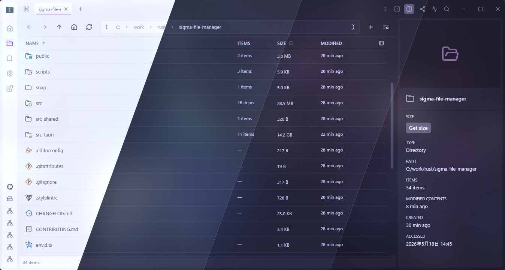
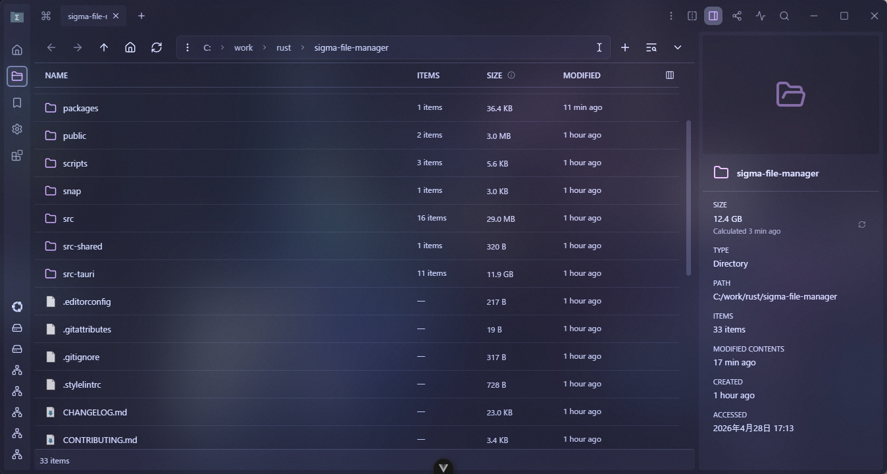
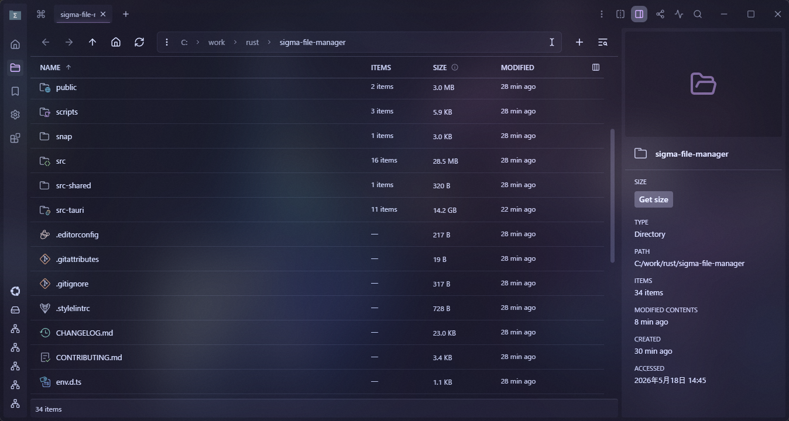

<h3 align="center">
   
  
  Catppuccin for <a href="https://github.com/aleksey-hoffman/sigma-file-manager">Sigma File Manager</a>
  
</h3>

  
  
  

  

Catppuccin for Sigma File Manager brings all four Catppuccin flavors to Sigma File Manager through the extension-contributed theme API:

- Latte
- Frappe
- Macchiato
- Mocha

## Status

This repository is currently maintained independently and is being prepared for Catppuccin Port Review and Sigma Marketplace submission.

## Previews

🌻 Latte

🪴 Frappe

🌺 Macchiato

🌿 Mocha

## Usage

1. Use a Sigma File Manager build that includes extension-contributed color themes.
2. Download or clone this repository.
3. Open **Extensions** in Sigma File Manager.
4. Choose **Install local extension** and select the root folder of this repository.
5. Open **Settings** > **Theme** and choose your preferred Catppuccin flavor.

Once the extension is published to the Sigma Marketplace, installation can move there without changing the theme contents.

## Notes

- The extension currently uses the `cos-overclock` publisher identity while it is maintained outside the Catppuccin organization.
- The palette values are derived from the Catppuccin flavors and adapted to Sigma File Manager's theme variables.

## 💝 Thanks to

- [Catppuccin](https://github.com/catppuccin)
- [Sigma File Manager](https://github.com/aleksey-hoffman/sigma-file-manager)
- [cos-overclock](https://github.com/cos-overclock)

&nbsp;

  

  Copyright &copy; 2021-present <a href="https://github.com/catppuccin" target="_blank">Catppuccin Org</a>

  

